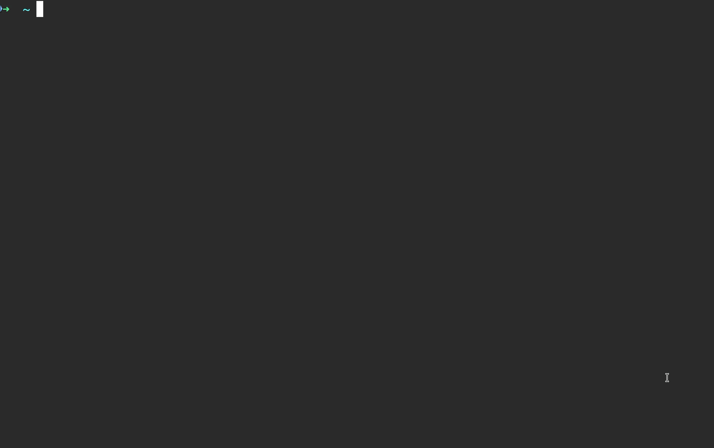

# konfirm

**konfirm**은 `kubectl` 명령을 실행하기 전에 **실제 적용될 context를 확인하고 승인하도록 하는 래퍼(wrapper)** 입니다.



## 주요 기능
- `--context` 오버라이드를 포함하여 **실제 적용되는 context 기준으로 확인 프롬프트를 표시**합니다.
- context 단위로:
  - 전체 kubectl 명령을 영구적으로 허용하거나
  - 특정 kubectl 서브커맨드만 선택적으로 허용할 수 있습니다.

## 사전 요구 사항
- `kubectl`이 설치되어 있고 PATH에 등록되어 있어야 합니다.
- `fzf` (선택 사항, `konfirm config` 명령어 사용 시 필요) - [설치 가이드](https://github.com/junegunn/fzf)

## 설치 방법

### Homebrew

```bash
brew install Jaehyeon1020/konfirm/konfirm
```

`konfirm` 설치 후 아래 코드를 실행하면, auto-completion 기능을 사용할 수 있습니다.

예를 들어 `konfirm kubectl get pods <tab>` 을 통해 조회 가능한 pod의 이름이 자동완성됩니다.

```bash
{
  echo ''
  echo '# konfirm setup'
  echo 'autoload -Uz compinit && compinit'
  echo 'source <(konfirm completion zsh)'
} >> ~/.zshrc

source ~/.zshrc
```

### 업데이트 (Homebrew)

```bash
brew update
brew upgrade Jaehyeon1020/konfirm/konfirm
```

### 제거

```bash
brew uninstall Jaehyeon1020/konfirm/konfirm
```

설정 파일(허용된 context 및 subcommand 포함)까지 삭제하려면:
```bash
rm -rf ~/Library/Application\ Support/konfirm
```

## 사용 방법

```bash
konfirm kubectl <kubectl args...>
konfirm config
konfirm add <subcommand>...
konfirm remove <subcommand>...
konfirm status
```

### 명령어별 설명과 예시

`konfirm kubectl <kubectl args...>`

`--context` 오버라이드를 포함한 실제 context를 확인한 뒤 kubectl을 실행합니다.

```bash
# 현재 context를 확인한 뒤 kubectl 실행.
konfirm kubectl get pods -n kube-system

# context 오버라이드를 명시적으로 확인.
konfirm kubectl --context prod-cluster get deploy
```

`konfirm config`

fzf를 사용하여 인터랙티브하게 허용된 서브커맨드를 관리합니다. 여러 서브커맨드를 한 번에 추가하거나 제거할 수 있는 더 편리한 방법을 제공합니다.

**참고:** 이 명령어는 `fzf`가 설치되어 있어야 사용할 수 있습니다. `fzf`가 없는 경우에도 `konfirm add`와 `konfirm remove` 명령어로 허용 항목을 관리할 수 있습니다.

```bash
# 인터랙티브 모드를 실행하여 서브커맨드를 추가하거나 제거.
konfirm config
```

`konfirm add <subcommand>...`

현재 context에서 하나 이상의 kubectl 서브커맨드를 항상 허용합니다. `--all`을 사용하면 모든 서브커맨드를 한 번에 허용할 수 있습니다.

```bash
# 현재 context에서 `kubectl apply` 항상 허용.
konfirm add apply

# 여러 서브커맨드를 한 번에 허용.
konfirm add get logs describe

# 현재 context에서 모든 kubectl 서브커맨드를 영구적으로 허용.
konfirm add --all
```

`konfirm remove <subcommand>...`

현재 context에서 허용한 하나 이상의 kubectl 서브커맨드를 제거합니다. `--all`을 사용하면 모든 허용 항목을 한 번에 제거할 수 있습니다.

```bash
# 현재 context에서 `kubectl apply` 허용을 해제.
konfirm remove apply

# 여러 서브커맨드를 한 번에 제거.
konfirm remove get logs describe

# 현재 context에서 모든 허용 항목을 제거.
konfirm remove --all
```

`konfirm status`

실제 context와 현재 허용 목록을 표시합니다.

```bash
# 현재 context에서 허용된 항목 확인.
konfirm status
```

## 팁

`~/.zshrc`에 alias를 추가한 뒤 쉘을 다시 로드하세요.

```bash
echo 'alias k="konfirm kubectl"' >> ~/.zshrc
source ~/.zshrc
```

이제 기존 kubectl 사용 방식 그대로 `konfirm`을 함께 사용할 수 있습니다.

```bash
# 이후 이 명령을 실행하면 승인 프롬프트가 표시됩니다.
k get pods
```

---
영문 README: [README.md](README.md)